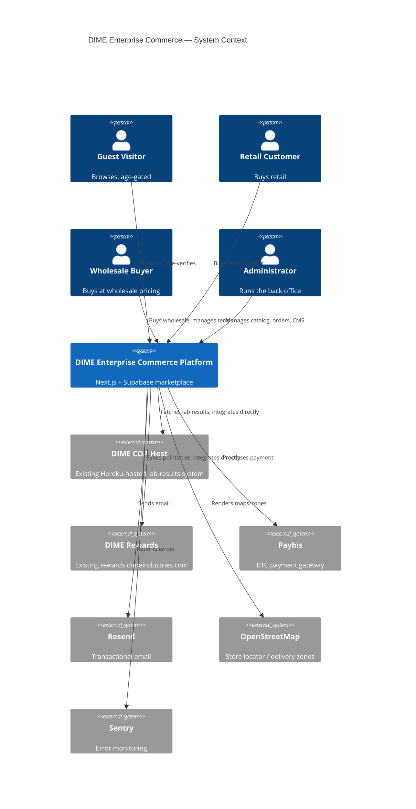
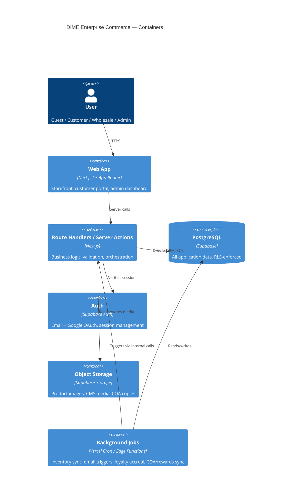
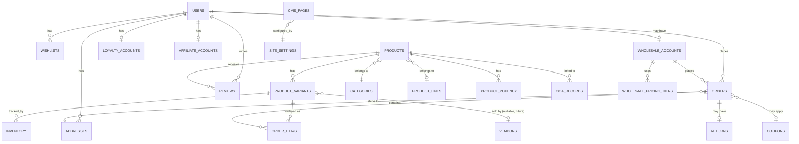

# DIME Enterprise Commerce Platform
## Architecture Design (v1.0) — Architect Mode

**Status:** Draft for review — no frontend/backend implementation code has been written. This is architecture only: information architecture, database design, API contracts, design tokens, and infrastructure — per the engineering workflow, code generation begins only after this is approved.

**Inputs locked from SRS approval:**
- Launch jurisdictions: derived below from research, not invented
- Age/ID standard: 21+ (flat, per your instruction)
- Wholesale payment terms: NET-30, NET-60, and upfront gateway-processed — all three supported, selectable per wholesale account
- COA + rewards: integrate directly with DIME's existing hosted systems rather than rebuild them
- Multi-vendor: not built now, but the data model below is vendor-ready
- Store locator / delivery zones: scoped to the launch jurisdictions below

---

## 1. Launch jurisdictions (derived from research)

You asked me to come up with something grounded in the research rather than invent it freely. Here's the reasoning:

- **California** — dimeindustries.com's own footer license numbers (Bud Technology Distribution, Adult and Medical: `C11-0001413-LIC`; Bud Technology Manufacturing, Adult and Medical: `CDPH-0003528`) place DIME's actual manufacturing/distribution licensure in California. This is the obvious primary launch state — it's where the brand is legally licensed to originate. California's adult-use program (DCC-regulated) supports both adult-use (21+) and medical patients, which is why the reference site distinguishes "Adult and Medical."
- **Massachusetts** — Rolling Releaf (a Massachusetts Cannabis Control Commission–licensed, Social Equity–certified delivery service based in Newton, serving Greater Boston) carries DIME Industries as a stocked brand across multiple product lines. That's independent evidence DIME already has real distribution reach into a second, legally distinct adult-use state.

**Recommendation:** launch in **California and Massachusetts**, both DCC/CCC-licensed adult-use markets, with the jurisdiction-gating system built so additional states are a configuration change, not a code change. Flag for you: I did not find primary-source evidence DIME is licensed to sell direct-to-consumer (vs. through licensed retailers/delivery partners) in either state — that's a real legal question for the actual business to resolve before launch, not something research can settle. The architecture below assumes the platform is the licensed seller of record; if instead it's a marketing/ordering layer that hands off to licensed retailers, section 8 (Order Fulfillment Model) below needs to change, and I'd want to know that before Backend Development.

**Age/ID verification:** 21+ flat minimum, enforced at the gate and re-checked at checkout. A `medical_patient` flag exists on the user model (nullable, unused for now) so a medical carve-out can be turned on later without a schema change — California's own site draws that distinction, so it seemed safer to leave the door open than to hard-block it structurally.

---

## 2. C4 architecture diagrams

### 2.1 System context



### 2.2 Container view



---

## 3. Information architecture (refined)

Builds on the sitemap from the project brief, now with URL structure and jurisdiction-awareness noted:

```
/                                    Home (age-gated on first visit)
/shop                                Full catalog, faceted filters
/shop/[category]                     Vapes | Edibles | Prerolls | Accessories
/shop/[category]/[line]              e.g. /shop/vapes/live-reserve
/product/[slug]                      PDP — potency, COA, reviews, related, wishlist toggle
/search?q=                           Search results
/cart
/checkout
/wholesale                           Wholesale landing + application
/wholesale/shop                      Wholesale catalog (auth-gated, wholesale role)
/locations                           Store/delivery locator, jurisdiction-scoped
/account/*                           Dashboard, orders, wishlist, addresses, profile,
                                      notifications, loyalty, affiliate, returns
/admin/*                             Products, categories, inventory, orders, customers,
                                      reviews, coupons, blog, CMS, analytics, reports,
                                      settings, audit-logs
/blog, /blog/[slug]
/faq, /about, /contact
/legal/terms, /legal/privacy, /legal/medical-privacy, /legal/returns
```

Jurisdiction gating applies at the data layer (query filters), not just the UI — a product invisible in Massachusetts must 404 or redirect if hit directly by URL from a Massachusetts session, not just be hidden from listings.

---

## 4. Database design

### 4.1 ER diagram (core commerce entities)



### 4.2 Table definitions (core set)

Full production migration will be finalized in the Backend/Integration phase; this establishes the contract now so frontend and backend work can proceed in parallel.

```sql
-- Users & identity
create table users (
  id uuid primary key default gen_random_uuid(),
  email text unique not null,
  phone text,
  role text not null default 'customer' check (role in ('guest','customer','wholesale','admin','vendor')),
  age_verified_at timestamptz,
  jurisdiction text,                    -- e.g. 'CA', 'MA' — set at signup/first order
  medical_patient boolean default false,-- reserved; not enforced at launch (21+ flat)
  created_at timestamptz not null default now()
);

create table addresses (
  id uuid primary key default gen_random_uuid(),
  user_id uuid references users(id) on delete cascade,
  line1 text not null, line2 text, city text not null,
  state text not null, postal_code text not null,
  jurisdiction text not null,           -- derived from state, indexed for gating queries
  is_default boolean default false
);

-- Catalog
create table categories (
  id uuid primary key default gen_random_uuid(),
  slug text unique not null, name text not null
);

create table product_lines (            -- Signature / Live Reserve / Rosin / etc.
  id uuid primary key default gen_random_uuid(),
  slug text unique not null, name text not null
);

create table products (
  id uuid primary key default gen_random_uuid(),
  slug text unique not null,
  name text not null,
  category_id uuid not null references categories(id),
  line_id uuid references product_lines(id),
  strain_type text check (strain_type in ('sativa','indica','hybrid','na')),
  description text,
  status text not null default 'draft' check (status in ('draft','active','archived')),
  allowed_jurisdictions text[] not null default '{}',  -- jurisdiction gating at the row level
  created_at timestamptz not null default now()
);

create table product_variants (
  id uuid primary key default gen_random_uuid(),
  product_id uuid not null references products(id) on delete cascade,
  sku text unique not null,
  weight_or_format text not null,       -- '1g', '2g', 'AIO', 'cartridge', etc.
  retail_price_cents integer not null,
  vendor_id uuid,                       -- nullable FK, reserved for multi-vendor
  created_at timestamptz not null default now()
);

create table product_potency (          -- always-visible potency attributes (Eaze pattern)
  variant_id uuid primary key references product_variants(id) on delete cascade,
  thc_pct numeric(5,2), cbd_pct numeric(5,2), cbn_pct numeric(5,2)
);

create table coa_records (              -- integration target, not source of truth
  id uuid primary key default gen_random_uuid(),
  product_id uuid not null references products(id) on delete cascade,
  external_coa_url text not null,       -- points at DIME's existing COA host
  batch_id text, tested_at date,
  synced_at timestamptz not null default now()
);

create table inventory (
  variant_id uuid primary key references product_variants(id) on delete cascade,
  quantity_on_hand integer not null default 0,
  jurisdiction text not null,           -- inventory can differ by fulfillment jurisdiction
  updated_at timestamptz not null default now()
);

-- Orders
create table orders (
  id uuid primary key default gen_random_uuid(),
  user_id uuid references users(id),
  wholesale_account_id uuid references wholesale_accounts(id),
  status text not null default 'pending',
  address_id uuid references addresses(id),
  coupon_id uuid references coupons(id),
  subtotal_cents integer not null, tax_cents integer not null,
  total_cents integer not null,
  payment_method text not null,         -- 'paybis_btc' at launch, extensible
  payment_terms text,                   -- null for retail; 'net30'|'net60'|'upfront' for wholesale
  created_at timestamptz not null default now()
);

create table order_items (
  id uuid primary key default gen_random_uuid(),
  order_id uuid not null references orders(id) on delete cascade,
  variant_id uuid not null references product_variants(id),
  quantity integer not null,
  unit_price_cents integer not null
);

-- Wholesale
create table wholesale_accounts (
  id uuid primary key default gen_random_uuid(),
  user_id uuid not null references users(id),
  business_name text not null,
  resale_cert_url text,
  approved boolean default false,
  default_payment_terms text not null default 'upfront'
    check (default_payment_terms in ('net30','net60','upfront')),
  created_at timestamptz not null default now()
);

create table wholesale_pricing_tiers (
  id uuid primary key default gen_random_uuid(),
  wholesale_account_id uuid references wholesale_accounts(id) on delete cascade,
  variant_id uuid references product_variants(id),
  price_cents integer not null,
  min_quantity integer not null default 1
);

-- Loyalty / affiliate / reviews / coupons / CMS — table shapes summarized, full DDL in Backend phase
-- loyalty_accounts(user_id, points_balance, tier, synced_with_dime_rewards_at)
-- affiliate_accounts(user_id, referral_code, payout_terms)
-- reviews(id, product_id, user_id, rating, body, verified_purchase, status)
-- coupons(id, code, type, value, starts_at, ends_at, usage_limit)
-- cms_pages(id, slug, blocks jsonb, status)
-- audit_logs(id, actor_id, action, entity, entity_id, diff jsonb, created_at)
```

### 4.3 Row-level security approach

Supabase exposes Postgres to the client, so RLS is load-bearing, not optional:
- `users`: a row is readable/writable only by its own `auth.uid()`, except admins.
- `orders`, `order_items`, `addresses`, `wishlists`, `reviews` (own reviews): scoped to `user_id = auth.uid()`, admins bypass via a `role() = 'admin'` policy.
- `products`, `product_variants`, `product_potency`, `categories`: public read for rows where the requester's session jurisdiction is in `allowed_jurisdictions` (or the array is empty = unrestricted); write restricted to admin.
- `wholesale_pricing_tiers`: readable only by the owning `wholesale_account_id`'s user, plus admin.
- `inventory`: no public read of exact quantities (avoid leaking stock levels/competitive intel) — expose only an in-stock/low-stock/out-of-stock derived status via a view.

### 4.4 Jurisdiction gating implementation note

Two enforcement points, matching the IA section above: (1) query-level filtering on every product/catalog read using the resolved session jurisdiction, and (2) a server-side check on checkout that re-validates the shipping address's jurisdiction against both account-level and per-item `allowed_jurisdictions` before payment is authorized — this closes the "direct URL to a gated product" gap called out in section 3.

---

## 5. API design (contract-level, not implementation)

Next.js Route Handlers for anything needing a stable HTTP contract (webhooks, mobile-future-proofing); Server Actions for form-bound mutations. Representative surface — full contract finalized in Backend Development phase:

| Method | Path | Purpose | Auth |
|---|---|---|---|
| GET | `/api/products` | List/search/filter catalog, jurisdiction-filtered | Public |
| GET | `/api/products/[slug]` | Product detail incl. potency, COA, reviews | Public |
| POST | `/api/cart/items` | Add item to cart | Session |
| POST | `/api/checkout/session` | Create checkout session, re-validate jurisdiction | Session |
| POST | `/api/webhooks/paybis` | Payment status webhook | Signed webhook |
| GET | `/api/account/orders` | Order history | Customer |
| POST | `/api/wholesale/apply` | Wholesale account application | Customer |
| GET | `/api/wholesale/pricing` | Wholesale-tier pricing for account | Wholesale |
| POST | `/api/reviews` | Submit review (verified-purchase gated) | Customer |
| GET | `/api/coa/[productId]` | Proxy/cache lab result from DIME's COA host | Public |
| POST | `/api/loyalty/sync` | Trigger sync with DIME rewards system | Internal/job |
| ADMIN | `/api/admin/*` | Full CRUD per section 3.12 of the SRS | Admin |

---

## 6. Integration architecture: COA host + Rewards (integrate, don't replace)

Per your direction, these stay as DIME's existing systems — the platform integrates rather than absorbs them:

- **COA integration:** `coa_records.external_coa_url` stores a reference to the existing Heroku-hosted COA app's record. A scheduled job (or on-demand proxy at request time, cached) pulls the COA for a given batch/SKU and surfaces it inline in the PDP — solving the "leaves the site" seam identified in the audit without duplicating DIME's lab-results system of record. Needs the existing COA host's actual API/data contract from the DIME team before this can be finalized — currently unknown from public research.
- **Rewards integration:** `loyalty_accounts.synced_with_dime_rewards_at` plus a sync job reconcile points/tier between the platform and `rewards.dimeindustries.com`, so the loyalty UI lives natively in the platform (fixing the audit's fragmentation finding) while the existing rewards system stays the source of truth. Also needs the existing system's actual API before finalizing — flagging as a dependency, not blocking the rest of the architecture.

---

## 7. Design system tokens (original — not copied from any reference site's brand assets)

These are original tokens for this build, not extracted from DIME's actual brand guidelines or any reference site's CSS — a real brand system would need DIME's actual brand assets from the business.

```css
:root {
  /* Color — deep, premium, cannabis-adjacent without copying any reference site's palette */
  --color-bg: #0E0F0C;
  --color-surface: #17190F;
  --color-primary: #7CB518;      /* leaf green, original tone */
  --color-primary-dark: #4F7A0F;
  --color-accent: #E8B04B;        /* warm gold, for CTAs/badges */
  --color-danger: #C1442E;
  --color-text-primary: #F5F5EF;
  --color-text-muted: #A9AC9E;

  /* Typography */
  --font-display: "General Sans", sans-serif;
  --font-body: "Inter", sans-serif;
  --scale-xs: 0.75rem; --scale-sm: 0.875rem; --scale-base: 1rem;
  --scale-lg: 1.25rem; --scale-xl: 1.75rem; --scale-2xl: 2.5rem;

  /* Spacing (4px base) */
  --space-1: 4px; --space-2: 8px; --space-3: 12px; --space-4: 16px;
  --space-6: 24px; --space-8: 32px; --space-12: 48px;

  /* Radius / elevation */
  --radius-sm: 6px; --radius-md: 12px; --radius-lg: 20px;
  --shadow-card: 0 4px 16px rgba(0,0,0,0.24);
}
```

Component inventory to build against these tokens: button (primary/secondary/ghost/destructive), input/select/combobox, product card (with potency badge), filter facet group, cart drawer, toast, skeleton loader, modal/dialog, data table (admin), badge (strain type, potency band, in-stock status), age-gate modal.

---

## 8. Order fulfillment model (assumption flagged)

Architecture above assumes DIME Enterprise Commerce is the licensed seller of record handling its own fulfillment/delivery per jurisdiction (own inventory, own delivery zones), analogous to how Rolling Releaf and Eaze operate as licensed delivery businesses. If the real model is instead "take orders, route fulfillment through licensed third-party retailers/delivery partners," the `inventory` and `orders` tables need a `fulfilling_retailer_id` concept and the checkout flow needs a retailer-selection step — worth confirming before Backend Development locks this in.

---

## 9. Infrastructure & deployment

- **Environments:** local → preview (per-PR Vercel deploys) → staging → production, each with its own Supabase project to keep data isolated.
- **CI/CD:** GitHub Actions runs typecheck, lint, unit tests (Vitest), and Playwright E2E on every PR; merge to `main` auto-deploys to staging; production deploy is a manual promotion after smoke tests pass.
- **Scaling for 100,000+ users:** Vercel edge caching + ISR for catalog/category/product pages (read-heavy, cacheable); Supabase connection pooling (PgBouncer) for the write path; a queue-backed inventory decrement (not a naive row update) to avoid oversell race conditions during high-demand drops; Sentry + Vercel Analytics for real-time visibility; a read-replica strategy revisited once real traffic data exists rather than pre-optimized speculatively.
- **Secrets:** Vercel environment variables per environment, never committed; Paybis keys and Supabase service-role key restricted to server-only contexts.

---

## 10. Key architecture decisions (ADR summary)

| # | Decision | Rationale | Trade-off accepted |
|---|---|---|---|
| 1 | Jurisdiction gating enforced at query layer + checkout re-check, not UI-only | Prevents direct-URL bypass of a real legal control | Slightly more complex query layer |
| 2 | `vendor_id` nullable on `product_variants` now | Avoids a breaking migration when multi-vendor ships | Minor unused-column overhead today |
| 3 | Integrate with existing COA/rewards systems via adapter tables, not migrate | Matches your explicit direction; avoids becoming system-of-record for data DIME already owns | Platform has an external dependency for two features |
| 4 | Wholesale supports NET-30/NET-60/upfront simultaneously, selected per account | Matches your "all of the above" answer | Requires basic AR/aging logic, not just a payment toggle |
| 5 | Potency (THC/CBD/CBN) modeled as its own table, not columns on variants | Matches the Eaze pattern of potency as a first-class, filterable attribute; also cleanly extensible (CBG, CBN, terpenes later) | One extra join on catalog reads |
| 6 | Payment abstraction layer around Paybis from day one | Cannabis industry's payment-rail volatility makes a single hardcoded gateway risky | Small added complexity now for real flexibility later |

---

## 11. Risk register

| Risk | Impact | Mitigation |
|---|---|---|
| Order fulfillment model assumption (section 8) is wrong | High — could invalidate inventory/checkout design | Confirm with business before Backend Development starts |
| COA host / Rewards system API contracts unknown | Medium — integration work is blocked until DIME provides access | Treat as an explicit dependency; build the adapter interface now, implement against real API when available |
| Payment rail (Paybis/BTC) is unfamiliar to many retail buyers | Medium — could suppress conversion | UX should clearly explain the payment flow at checkout; abstraction layer allows adding a second gateway without rework |
| Jurisdiction list is currently inferred, not confirmed by legal | High — wrong jurisdiction = real regulatory exposure | Explicit sign-off needed from DIME's legal/compliance function before go-live, independent of engineering readiness |
| 100k-user scale target with no current traffic data | Medium | Build for read-heavy caching now; defer read-replica/sharding decisions until real usage data exists |

---

## 12. Roadmap (maps to the engineering workflow)

1. ✅ Business analysis & requirements (SRS) — approved
2. ✅ Reference site analysis — done
3. ✅ This architecture document — **pending your approval**
4. UI/UX design — wireframes/high-fidelity for PDP, PLP, cart, checkout, account, admin
5. Frontend development — component library, then page-by-page build
6. Backend development — Route Handlers/Server Actions per section 5
7. Integrations — Supabase, Paybis, Resend, COA/Rewards adapters, OpenStreetMap
8. Admin dashboard build-out
9. Automated testing (Vitest + Playwright)
10. Accessibility, SEO, security review passes
11. Performance optimization against section 5's non-functional targets
12. Documentation & deployment
13. Monitoring & continuous improvement

---

**Status: awaiting your approval to proceed to UI/UX design (Frontend Mode) and the parallel Backend build.** Before that starts, it would help to know your position on the order-fulfillment-model assumption in section 8, since it changes the inventory/order schema — happy to proceed with the current assumption and revise later if you'd rather not block on it now.
