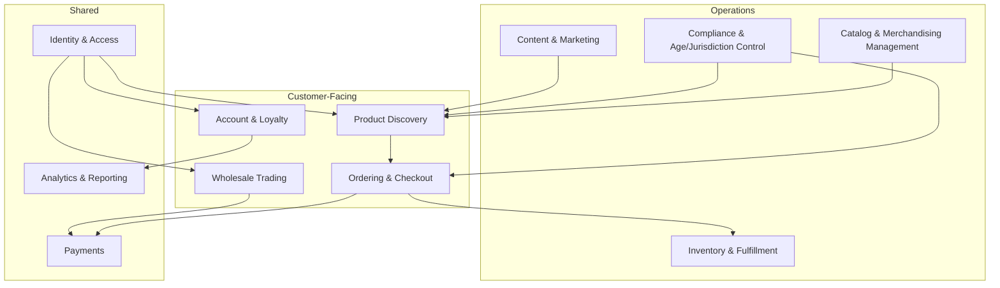
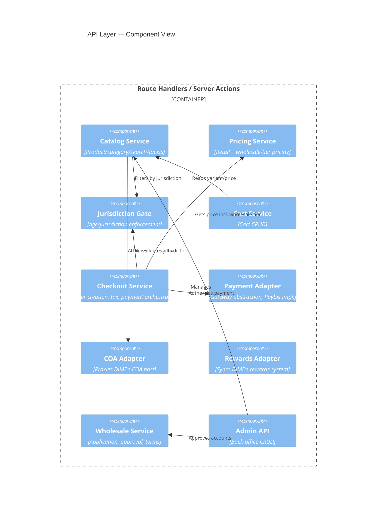
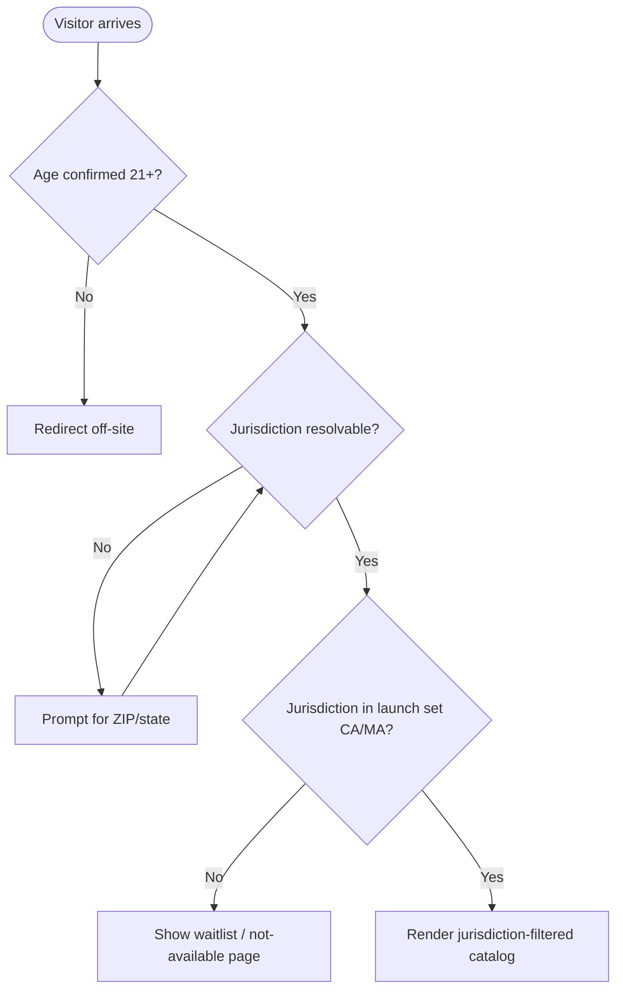
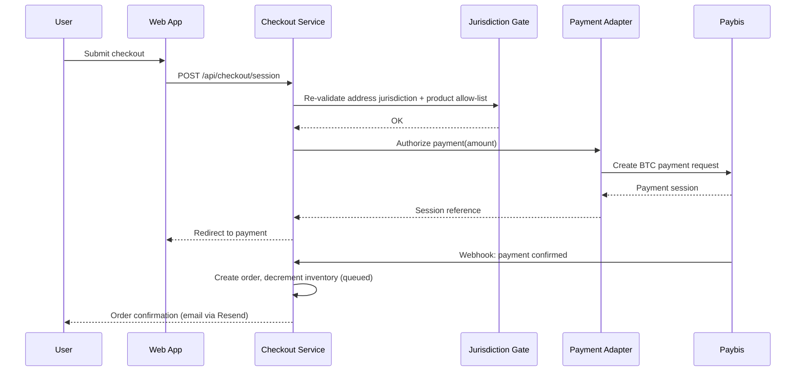
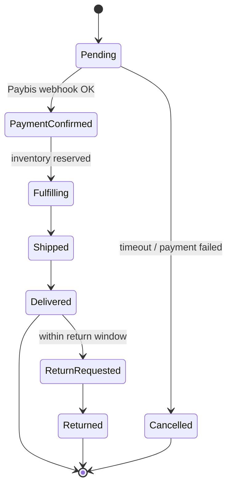
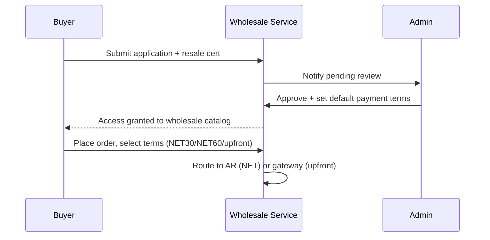
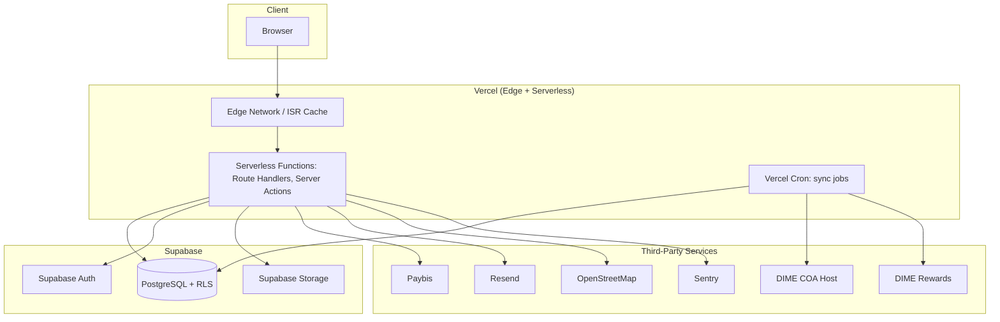
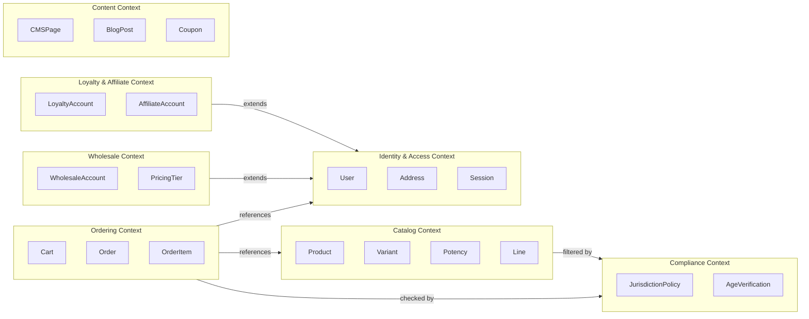
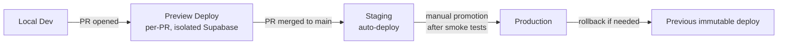
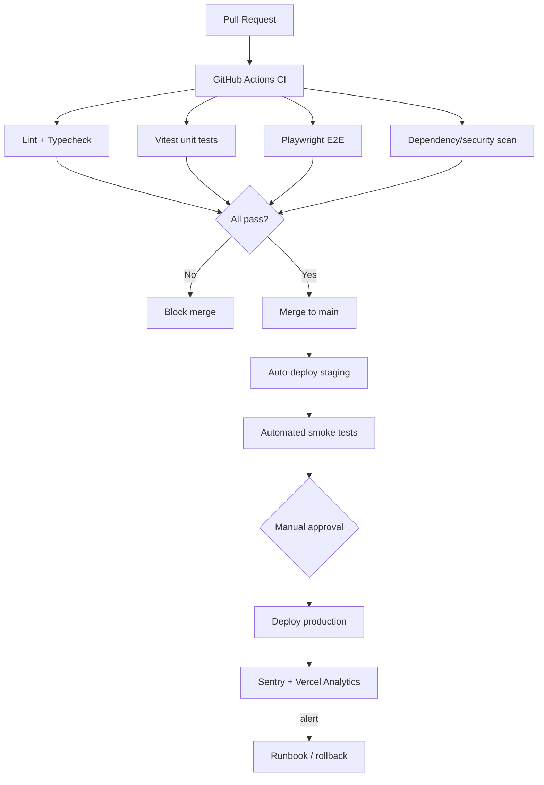

# DIME Enterprise Commerce Platform
## Complete Software Architecture (v1.0) — Architect Mode

**Status:** Draft for review. No implementation code. This document formalizes and extends `DIME-Enterprise-Commerce-Architecture.md` (C4 context/container, ER diagram, table DDL, API contract table, design tokens, ADRs, risk register — still authoritative for those; not repeated in full here) into the eleven areas requested. Locked inputs carried forward: launch jurisdictions CA + MA, 21+ flat age gate, wholesale supports NET-30/NET-60/upfront, COA + Rewards are integrations not rebuilds, schema is vendor-ready but vendor UI is not built now.

---

## 1. Business Architecture

### 1.1 Business capability map

### 1.2 Value streams

- **Retail purchase value stream:** Discover → Age/jurisdiction gate → Filter/search → Product detail (potency + COA) → Cart → Checkout (address re-validated against jurisdiction) → Payment (Paybis) → Fulfillment → Post-purchase (review, loyalty accrual, reorder).
- **Wholesale purchase value stream:** Apply → Verification (resale cert) → Approval → Tiered pricing catalog → Bulk order → Payment terms selection (NET-30/60/upfront) → Fulfillment → Invoicing/AR.
- **Admin operations value stream:** Catalog authoring → Inventory sync → Order monitoring → Customer support → CMS/promotions → Reporting → Compliance audit.

### 1.3 Stakeholder map

| Stakeholder | Concern |
|---|---|
| Retail customers | Fast, trustworthy, fee-transparent shopping |
| Wholesale buyers | Accurate tiered pricing, flexible terms, reliable fulfillment |
| DIME admin/ops staff | Operational control without engineering dependency |
| DIME legal/compliance | Jurisdiction correctness, age verification, licensing display |
| Engineering/DevOps | Maintainability, scalability to 100k+ users, security |
| Future vendors (not yet onboarded) | A data model that doesn't require a rebuild to join |

### 1.4 Goals-to-capability traceability

Every capability above maps back to an SRS section (§3.1–3.14) — this is a checkpoint that nothing in the requirements is architecturally homeless: Compliance & Age/Jurisdiction Control → SRS §3.1/§7; Catalog & Merchandising → §3.2; Discovery → §3.3; Ordering & Checkout → §3.4; Account & Loyalty → §3.5/§3.8; Wholesale Trading → §3.6; Content & Marketing → §3.10; Fulfillment → §3.4/§8 (open question); Identity & Access → §2.2.

---

## 2. C4 Diagrams

Context and Container diagrams are defined in the prior architecture document (section 2) and remain authoritative. Adding the Component-level breakdown for the Route Handlers/Server Actions container, since that's where the domain logic actually lives:

---

## 3. Mermaid Diagrams (behavioral)

### 3.1 Age + jurisdiction gate flow

### 3.2 Checkout sequence

### 3.3 Order lifecycle (state machine)

### 3.4 Wholesale approval flow

ER diagram remains as defined in the prior document (section 4.1) — not duplicated here.

---

## 4. Infrastructure

Each environment (dev/preview/staging/production) gets its own Supabase project — no shared database across environments, so a staging bug can never touch production data.

---

## 5. Database Architecture

Full ER diagram, table DDL, and RLS policy design are in the prior document (section 4) and remain authoritative. Architecture-level concerns added here:

- **Isolation:** one Supabase (Postgres) instance per environment; no cross-environment credentials ever coexist in the same secret scope.
- **Migrations:** Drizzle Kit-generated, linear, forward-only migrations checked into version control; migrations run as a CI/CD gate before deploy, never applied manually against production.
- **Backup & DR:** Supabase point-in-time recovery enabled on the production project; daily automated backups retained per Supabase's plan tier; a documented restore runbook is a Deployment Architecture deliverable (section 8), not just a database setting.
- **Connection management:** PgBouncer (Supabase's pooled connection string) used for all serverless function connections to avoid exhausting Postgres's connection limit under concurrent 100k-user load; a small set of direct (unpooled) connections reserved for migrations only.
- **Read scaling path:** not built at launch (per the risk register — no traffic data yet). The schema avoids anything that would block adding a read replica later (no session-scoped temp tables, no reliance on same-connection transactional state across requests).
- **Hot-path indexing:** composite indexes on `products(category_id, status)`, `products` GIN index on `allowed_jurisdictions`, `inventory(variant_id, jurisdiction)`, `orders(user_id, created_at desc)` for account order history, `product_variants(sku)` unique index already covers catalog lookups.
- **Data retention:** age-verification timestamp retained on the user record (compliance evidence); no raw ID-scan images stored unless a chosen ID-verification vendor requires it — if so, that data goes in Storage with a strict retention/deletion policy, not the primary database.

---

## 6. Domain Model (DDD)

### 6.1 Bounded contexts

### 6.2 Aggregates and invariants

| Aggregate root | Contains | Key invariant |
|---|---|---|
| **Order** | OrderItems, applied Coupon reference | Total = Σ(item price × qty) − discount + tax; immutable once `PaymentConfirmed` |
| **Product** | Variants, Potency, allowed jurisdictions | A variant cannot exist without a parent product; `allowed_jurisdictions` governs every variant under it |
| **Cart** | CartItems | Cannot contain a variant not currently `active` and jurisdiction-allowed for the session |
| **WholesaleAccount** | PricingTiers | Pricing tiers only resolvable once `approved = true` |
| **User** | Addresses, AgeVerification state | Cannot place an order without `age_verified_at` set |

### 6.3 Domain events (for future event-driven pieces — not required at launch, but named so the codebase has the right seams)

`OrderPlaced`, `PaymentConfirmed`, `InventoryReserved`, `InventoryLow`, `WholesaleAccountApproved`, `LoyaltyPointsAccrued`, `ReviewSubmitted`, `JurisdictionPolicyChanged`. These become real (e.g. via Supabase's `pg_notify` or a lightweight queue) only if/when a feature genuinely needs async fan-out — noted now so Backend Development doesn't have to retrofit the concept.

---

## 7. API Architecture

Builds on the contract table in the prior document (section 5). Cross-cutting conventions:

- **Layering:** Server Actions for same-origin form mutations (cart, checkout, account forms); Route Handlers for anything needing a stable external contract — webhooks (Paybis), the future mobile app, and admin bulk operations.
- **Versioning:** Route Handlers are namespaced `/api/v1/...` from day one, even with only one consumer today, so a breaking change never requires an in-place rewrite.
- **Error contract:** every API error returns `{ error: { code, message, details? } }` with a consistent HTTP status; client-facing messages never leak internal stack detail.
- **Idempotency:** the Paybis webhook handler is idempotent on the gateway's payment reference — replay-safe, since webhook delivery is at-least-once by nature.
- **Rate limiting:** applied at the edge (Vercel) for public endpoints (`/api/products`, `/api/search`) to blunt scraping/abuse; stricter limits on `/api/checkout/*` and `/api/reviews`.
- **Pagination:** cursor-based on all list endpoints (`/api/products`, `/api/account/orders`, admin lists) — offset pagination doesn't hold up at 100k-user scale with frequently-changing catalogs.

---

## 8. Security Architecture

- **AuthN:** Supabase Auth, email + Google OAuth; session as an httpOnly, secure, SameSite=Lax cookie.
- **AuthZ:** role-based (`guest`/`customer`/`wholesale`/`admin`/future `vendor`) enforced at two layers — RLS policies at the database (section 5 / prior doc §4.3) as the hard boundary, plus route-level guards in the API layer for defense-in-depth and better error messaging.
- **OWASP Top 10 mapping:**
  - *Injection:* Drizzle's parameterized queries throughout; no raw string SQL concatenation.
  - *Broken auth:* Supabase Auth handles credential storage/rotation; no custom password logic.
  - *Sensitive data exposure:* payment credentials never touch the app's database — Paybis handles payment data; PII (address, phone) covered by RLS.
  - *Broken access control:* RLS as the primary control, tested explicitly per role in the QA phase.
  - *Security misconfiguration:* environment variables never in source; CSP and security headers set at the Vercel edge config.
  - *XSS:* React's default escaping + a strict CSP; CMS content (rich text) sanitized server-side before storage, not just at render.
  - *CSRF:* Server Actions have built-in origin checks; Route Handlers require a same-site or signed-request check for state-changing calls.
  - *Vulnerable components:* automated dependency scanning (`npm audit` / Dependabot) in CI.
  - *Insufficient logging:* `audit_logs` table (prior doc §4.2) for admin actions; Sentry for application errors; Vercel/Supabase logs for infra-level events.
  - *SSRF:* the COA/Rewards adapters and OpenStreetMap calls are the only outbound server-initiated requests to external hosts — allow-listed by domain, not dynamically constructed from user input.
- **Payment security:** Paybis handles the actual payment/wallet flow; the platform stores only a payment reference/status, never wallet keys or raw payment credentials.
- **Compliance data handling:** age-verification evidence and jurisdiction determination are treated as compliance-sensitive — access to that data in the admin panel is itself audit-logged, not just the customer-facing gate.
- **Secrets management:** per-environment Vercel secrets; Supabase service-role key restricted to server contexts only, never shipped to the client bundle.

---

## 9. Deployment Architecture

- **Promotion gate:** merge to `main` auto-deploys to staging only; production is a manual, explicit promotion after smoke tests pass — no direct-to-prod deploys.
- **Rollback:** Vercel's immutable deployments mean rollback is "promote the previous deployment," not a rebuild — near-instant.
- **Feature flags:** used for anything risky enough to want a kill switch without a redeploy (e.g. a new checkout step, a new jurisdiction going live) — simple boolean flags in `site_settings` initially, a dedicated flag service only if the need grows.
- **Database migrations in the pipeline:** migrations run as a distinct, gated CI step before the app deploy that depends on them — never bundled silently into app startup.
- **DR runbook (referenced from section 5):** documented steps for point-in-time restore, who's authorized to trigger it, and a communication plan — a Documentation-phase deliverable, flagged here so it isn't forgotten.

---

## 10. DevOps Architecture

- **IaC posture:** Vercel and Supabase are both configuration-as-code where practical (Vercel project config, Supabase migrations + declarative RLS policies in version control) — no manual dashboard-only changes for anything that matters to correctness.
- **Observability stack:** Sentry (errors, with source maps), Vercel Analytics (Core Web Vitals, traffic), Supabase's built-in query/log dashboard (slow queries), structured logging from Route Handlers correlated by request ID.
- **Alerting:** Sentry alert rules for error-rate spikes; a simple uptime check against `/api/health` for availability; alert thresholds tuned after real traffic data exists rather than guessed at launch.
- **Environment parity:** staging uses the same Vercel/Supabase configuration shape as production (scaled down), so "works in staging" is a meaningful signal.

---

## 11. Scalability Plan

Target: 100,000+ users. Approach is staged, not everything built for peak load on day one — matches the risk register's point that pre-optimizing without traffic data is its own risk.

**Phase 1 (launch):**
- Edge caching + ISR for catalog/category/PDP pages (the highest-traffic, most cacheable surface).
- PgBouncer pooled connections; indexes as listed in section 5.
- Queue-backed inventory decrement (not a naive `UPDATE ... SET quantity = quantity - 1`) to prevent oversell under concurrent checkout load — this is a launch requirement, not a later optimization, because overselling a federally-scheduled, licensed product has real compliance/legal weight beyond the usual "annoyed customer" cost.
- Stateless serverless functions (Vercel) scale horizontally by default — no architectural work needed for that dimension at launch.

**Phase 2 (growth, triggered by real metrics, not a calendar date):**
- Introduce a Postgres read replica once read QPS on the primary shows sustained pressure; route catalog reads there, keep writes on primary.
- Move from a naive queue (Vercel Cron-driven) to a proper message queue if inventory/order volume shows contention.
- CDN-level image optimization tuning based on actual Core Web Vitals data from Vercel Analytics, not assumed.

**Phase 3 (multi-vendor activation, whenever the business date lands):**
- The `vendor_id` seam (prior doc §10, decision 2) means this is additive — new vendor onboarding flows, vendor-scoped RLS policies, and a vendor payout/reconciliation service, without a catalog/order schema rewrite.

**Load testing:** a Phase 1 exit criterion, not optional — synthetic load against checkout and catalog search before the first real jurisdiction goes live, specifically targeting the inventory-decrement path under concurrency.

---

## Summary of what's still open before Frontend/Backend build

Carried forward from the prior document, unresolved: the **order fulfillment model** (section 8 of the prior architecture doc) — whether DIME Enterprise Commerce is the licensed seller of record or a front-end routing to third-party licensed fulfillment. Everything in this document (inventory design, order state machine, domain model) assumes the former. New from this pass: the **actual DIME COA host and Rewards system API contracts** are still unknown and block finalizing the two adapter components in section 2/section 6.

**Status: awaiting your approval before UI/UX design and implementation begin.**
