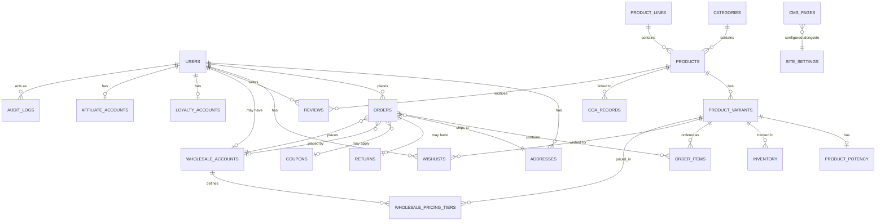

# DIME Enterprise Commerce Platform
## Database Design — Database Mode (v1.0)

**Status:** Draft for review. No frontend built. Companion code files (not implementation of app logic — schema/migration/seed artifacts only, as Database Mode produces): `db/schema.ts` (Drizzle), `db/migrations/0001_init.sql`, `db/rls_policies.sql`, `db/seed.ts`.

---

## 1. ER diagram (complete)

## 2. Relationships (narrative)

- **User ⟷ Address (1:N):** a user may have several addresses; `is_default` flags the primary one; `jurisdiction` is stored redundantly on the address (not just derived from `state`) so jurisdiction-gating queries never need a join or a lookup table at request time.
- **Product ⟷ Variant (1:N):** every purchasable SKU is a variant; the product itself is never directly orderable — this matches the "grid-level Add to Cart vs. Select Options" UX pattern from the research phase (single-variant products can resolve their one variant automatically; multi-variant products route to selection).
- **Variant ⟷ Potency (1:1):** split out as its own table rather than columns on the variant, per ADR #5 (prior architecture doc) — keeps potency extensible (terpenes, CBG, etc. later) and keeps the variant row lean for the hot catalog-read path.
- **Variant ⟷ Inventory (1:N, composite key on variant+jurisdiction):** the same SKU can have different stock levels per fulfillment jurisdiction — required because CA and MA are legally separate markets, not just shipping zones.
- **Order ⟷ Wholesale Account (N:1, nullable):** a null `wholesale_account_id` means a retail order; a populated one means wholesale, letting both flow through one `orders` table instead of two parallel schemas.
- **Wholesale Account ⟷ Pricing Tier (1:N):** account-specific negotiated pricing per variant, distinct from the retail `retail_price_cents` on the variant itself.
- **User ⟷ Loyalty/Affiliate (1:1, nullable):** both optional per-user extensions rather than columns on `users`, so the core identity table stays small and these can be migrated/synced independently against DIME's external rewards system.

## 3. Indexes

| Table | Index | Purpose |
|---|---|---|
| users | unique(email) | Login lookup, prevent duplicate accounts |
| addresses | (user_id), (jurisdiction) | Account address list; jurisdiction gating joins |
| products | unique(slug) | PDP routing |
| products | (category_id, status) | Category listing, only active products |
| products | GIN(allowed_jurisdictions) | Jurisdiction-filtered catalog reads — the single highest-traffic query pattern |
| product_variants | unique(sku), (product_id) | SKU lookup; variant list per product |
| coa_records | (product_id) | PDP lab-result attachment |
| orders | (user_id, created_at desc) | Account order history, paginated |
| order_items | (order_id) | Order detail assembly |
| wholesale_pricing_tiers | unique(wholesale_account_id, variant_id) | One negotiated price per account per SKU |
| reviews | (product_id) | PDP review list |
| audit_logs | (entity, entity_id), (created_at) | Admin audit trail lookup and retention queries |

## 4. Constraints

- **Check constraints** enforce enum-like fields at the database, not just the application layer, so a bug in one API route can never write an invalid `status`, `role`, `strain_type`, or `payment_terms` value: see `role`, `status` (products/orders/returns/reviews/coupons), `strain_type`, `default_payment_terms`.
- **Non-negative money/quantity checks** on `retail_price_cents`, `quantity_on_hand`, `subtotal_cents`/`tax_cents`/`total_cents`, and `quantity > 0` on order items — prevents a whole class of data-corruption bugs at the source.
- **Foreign keys with explicit cascade behavior:** child rows that only make sense with their parent (`product_variants` → `products`, `order_items` → `orders`, `wishlists` → `users`/`product_variants`) cascade on delete; rows that should survive a parent's soft-removal (e.g. `orders.user_id`) intentionally don't cascade, so historical orders aren't silently destroyed if a user account is later deleted.
- **Uniqueness:** `email`, `sku`, `slug` (products/categories/lines/cms_pages), `coupons.code`, `affiliate_accounts.referral_code` all enforced at the database, not just checked in application code.

## 5. Supabase RLS (summary — full policy SQL in `db/rls_policies.sql`)

Every table has RLS enabled — nothing is left open by omission. Pattern used throughout: `current_user_role()` and `current_user_jurisdiction()` helper functions (SQL, `security definer`) centralize the role/jurisdiction lookup so policies stay short and consistent rather than each repeating a subquery against `users`.

- **Public-read, admin-write:** `categories`, `product_lines`, `product_potency`, `coa_records`, published `cms_pages`.
- **Jurisdiction-gated public read, admin write:** `products`, `product_variants` (via a join back to their parent product's status/jurisdiction) — this is the RLS-layer enforcement of the jurisdiction gate called out in the architecture doc, not just an application-layer filter.
- **Owner-only:** `addresses`, `wishlists`, `loyalty_accounts` (read), `affiliate_accounts`.
- **Owner-or-admin:** `users`, `orders`, `order_items` (via order), `returns` (via order), `wholesale_accounts`, `wholesale_pricing_tiers` (via account).
- **No public read at all:** `inventory` (raw quantities could leak competitive/stock intel) — a derived `inventory_status` view (`in_stock`/`low_stock`/`out_of_stock`) is granted to `authenticated`/`anon` instead, so the storefront never needs raw-table access.
- **Admin-only, no client insert path:** `audit_logs` — writes only via the server-side service-role key, so a compromised client session can never tamper with the audit trail.

## 6. Drizzle schema

Full schema in `db/schema.ts` — every table above expressed as `pgTable` definitions with matching indexes, checks, and `relations()` for Drizzle's relational query API (`db.query.products.findMany({ with: { variants: true } })`-style access). Money is stored as integer cents throughout (no floating-point currency), UUIDs via `gen_random_uuid()`, timestamps as `timestamptz` throughout — no naive timestamps, since CA and MA are different time zones and reporting needs to be unambiguous.

## 7. Migration plan

- **Tooling:** `drizzle-kit generate` produces migrations from `schema.ts`; `db/migrations/0001_init.sql` here is the hand-verified equivalent of that first generated migration, given as the concrete starting point.
- **Sequencing:** migrations are strictly linear and forward-only (`0001_init.sql`, `0002_...`, etc.) — no branching migration history. `db/rls_policies.sql` is applied as its own migration immediately after `0001_init.sql`, kept separate so schema changes and policy changes are independently reviewable in pull requests.
- **CI gate:** per the Deployment Architecture (prior document, section 9), migrations run as a distinct CI step against staging before the app deploy that depends on them; production migrations run the same way during the manual promotion step, never applied by hand.
- **Rollback posture:** each migration should be paired with a down-migration or a documented manual-revert procedure before it's allowed to merge — not enforced by the tooling, so this needs to be a PR-review checklist item in the Documentation/DevOps phase.
- **Zero-downtime discipline for later migrations:** additive changes (new nullable column, new table) ship freely; destructive changes (drop column, tighten a constraint) follow an expand-migrate-contract pattern once real production data exists — not a concern for `0001_init.sql` itself, but worth stating now so it's the default habit from the second migration on.

## 8. Seed data

`db/seed.ts` (Drizzle + `postgres.js`) seeds: the four launch categories, three sample product lines, baseline `site_settings` (launch jurisdictions, min age, feature flags), one sample product/variant/potency/inventory row per launch jurisdiction, and a placeholder admin user row for local admin-panel development. Explicitly **not** intended for production — real admin accounts are provisioned through Supabase Auth, and the real catalog comes from a proper import, not seed data.

## 9. Optimization strategy

- **Hot path = catalog reads.** The `(category_id, status)` composite index and the `allowed_jurisdictions` GIN index directly target the single most frequent query: "active products in category X visible in jurisdiction Y." Combined with Vercel's edge/ISR caching (Infrastructure, prior doc), most catalog reads should never hit Postgres at all after the first request for a given cache key.
- **Inventory writes are the contention point, not reads.** The composite `(variant_id, jurisdiction)` primary key supports row-level locking scoped tightly enough that concurrent checkouts for *different* SKUs never block each other; the actual decrement should go through a single `UPDATE ... WHERE quantity_on_hand >= :qty` (optimistic, not read-then-write) inside the checkout transaction, backed by the queue-based approach called out in the Scalability Plan, rather than relying on the check constraint alone as the only defense against overselling.
- **Avoid N+1 on order history and PDP.** Drizzle's `relations()` + relational query API let the account order-history page and the PDP fetch variant/potency/inventory-status/reviews in one query each rather than one query per related row — worth enforcing as a code-review habit once Backend Development starts.
- **Money as integer cents, not `numeric`/`float`, on hot tables** (`orders`, `order_items`, `product_variants`) avoids both floating-point rounding bugs and the extra storage/comparison cost of `numeric` on the highest-volume tables; `numeric` is reserved for potency percentages, where fractional precision genuinely matters and volume is much lower.
- **Defer, don't pre-build, the read replica.** Consistent with the Scalability Plan: the schema and index choices above are replica-friendly (no session-scoped temp state, no advisory locks spanning requests) so a read replica is a routing change later, not a redesign — but it isn't provisioned now, per the risk register's point about not over-building ahead of real traffic data.

---

**Status: awaiting your approval before Frontend/Backend build begins.**
